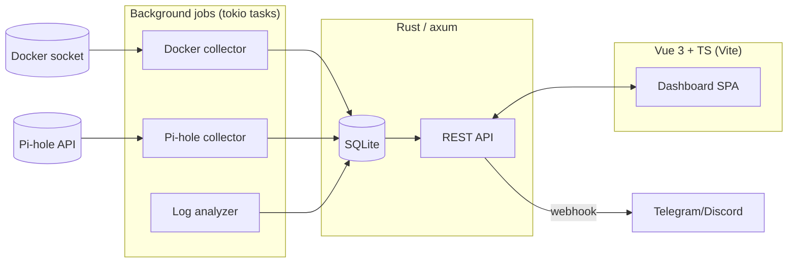

# Arquitetura — Homelab Sentinel

## Stack

| Camada       | Escolha                          | Motivo |
|--------------|-----------------------------------|--------|
| Backend      | Rust + [axum](https://github.com/tokio-rs/axum) + tokio | Performance, async nativo, já é a stack que uso no homelab |
| Frontend     | Vue 3 + TypeScript + Vite         | Stack preferida, SPA reativa de verdade (não htmx) |
| Comunicação  | REST (poll) no MVP → SSE/WebSocket depois | Começar simples, evoluir pra push quando o polling incomodar |
| Banco        | SQLite via `sqlx`                | Zero-config, um arquivo, suficiente pro volume de dados |
| Coleta Docker| [`bollard`](https://github.com/fussybeaver/bollard) (cliente Docker API async) | Idiomático em Rust, evita shell out pro `docker` CLI |
| Notificações | `reqwest` → webhook Telegram/Discord | Simples, sem dependência de infra extra |
| Deploy       | Docker multi-stage build + docker-compose | Consistente com o resto do stack |

## Diagrama (alto nível)



## Estrutura de pastas

```
homelab-sentinel/
├── backend/
│   ├── Cargo.toml
│   ├── Dockerfile
│   └── src/
│       ├── main.rs        # bootstrap axum + tokio tasks
│       ├── docker.rs       # coletor via bollard
│       ├── routes.rs       # handlers HTTP
│       └── state.rs        # AppState compartilhado (SQLite pool, cache)
├── frontend/
│   ├── package.json
│   ├── vite.config.ts
│   ├── index.html
│   └── src/
│       ├── main.ts
│       ├── App.vue
│       ├── api.ts          # client HTTP tipado
│       └── components/
│           └── ContainerTable.vue
└── docs/                   # este vault
```

## Decisões e por quê

- **Poll antes de SSE/WebSocket**: a v1 usa polling simples no frontend
  (`setInterval` + fetch) porque é mais fácil de debugar. SSE entra no
  Passo 3 do roadmap, quando o polling já estiver demonstrando o que precisa
  ser "empurrado" em tempo real.
- **SQLite em vez de Postgres**: não há concorrência de escrita significativa
  (um único coletor por vez), então não vale a complexidade de rodar mais um
  container de banco.
- **bollard em vez de `docker` CLI via `std::process::Command`**: evita
  parsing de texto e shell-injection, e é assíncrono nativamente.

## Versionamento e CI/CD

- **Repositório:** Git + GitHub. Um repo só, monorepo (`backend/` +
  `frontend/` + `docs/`) — não vale a complexidade de repos separados
  pro tamanho deste projeto.
- **CI (GitHub Actions, `.github/workflows/ci.yml`):** roda em todo
  push e pull request.
  - Backend: `cargo build`, `cargo test`, `cargo clippy -- -D warnings`.
  - Frontend: `npm ci`, `vue-tsc` (type-check), `npm run build`.
  - Isso pega os mesmos erros que validamos manualmente na Fase 0
    (compilação Rust + checagem de tipos TS), automaticamente a cada
    mudança.
- **Branch protection:** `main` exige CI verde antes de merge. Trabalho
  do dia a dia em branches (`feature/coletor-docker`, etc.) com PR.
- **CD (a partir da Fase 6):** workflow separado que builda as imagens
  Docker (backend + frontend) e faz deploy no homelab via SSH,
  disparado por push na `main` ou por tag. Até lá, deploy continua
  manual (`scp` + `docker compose up -d --build`, ver [[04-Setup]]).
- **Segredos:** credenciais de deploy (chave SSH do homelab, etc.) vão
  em GitHub Secrets, nunca commitadas — nem mesmo em `.env` de exemplo
  com valores reais.

## Convenções de código

- Erros: `thiserror` no backend, propagados como `Result<T, AppError>` que
  implementa `IntoResponse`.
- Frontend: composables (`useContainers()`, etc.) em vez de lógica direto
  nos componentes `.vue`.
- Toda mudança de schema do SQLite via migração (`sqlx migrate`), nunca
  `ALTER TABLE` manual.
